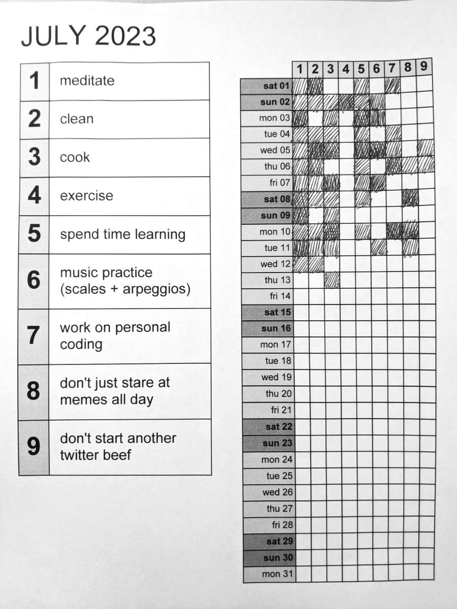

# routinetrax

## what is routinetrax?

routinetrax is a monthly routine tracking system, using sheets that track up to 9 routines over the course of a month. It features a tracking grid, which shows patterns that are easy to notice and reason about. It's like looking at a month's worth of journal entries, but condensed into a grid on a single sheet of paper.

Let's take this prototype sheet.

Looking at the tracking table, we can easily compare activity over certain time periods. A lot of stuff happened on June 9-11, but the data's a bit more sparse around the 14-16. Maybe this person didn't have the energy to do everything, or was focusing exclusively on the accomplished tasks. 

")

We can also look at how consistency across routines. Here, we can see that routine #1 happened pretty consistently throughout the month. Whereas routine #4 only got some attention during certain weeks.

")

## who is this for?

If you can describe yourself as "obsessive", "A-type", or a "self-improvement fanatic", you might find this useful. Or if you want to get some of the benefits of a journal, but focused entirely on the actions you take.

For more info, check [here](doc/extra-readme.md)
